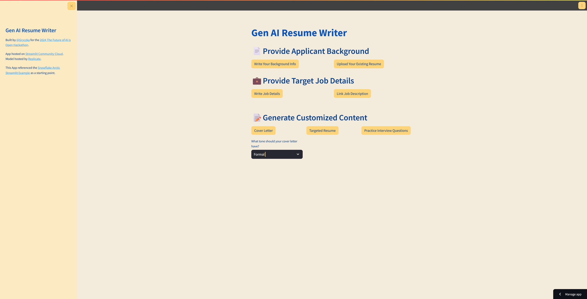
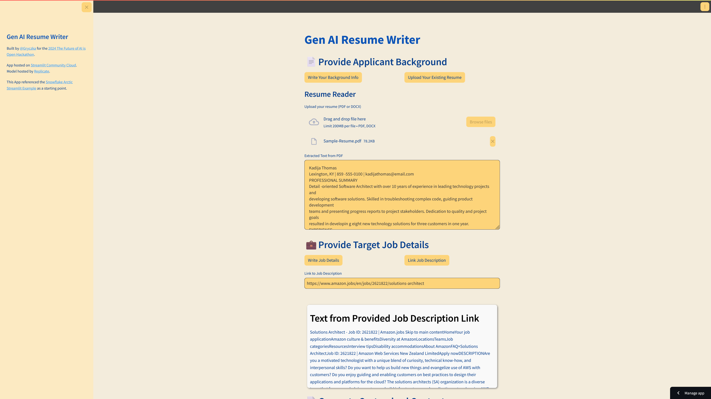
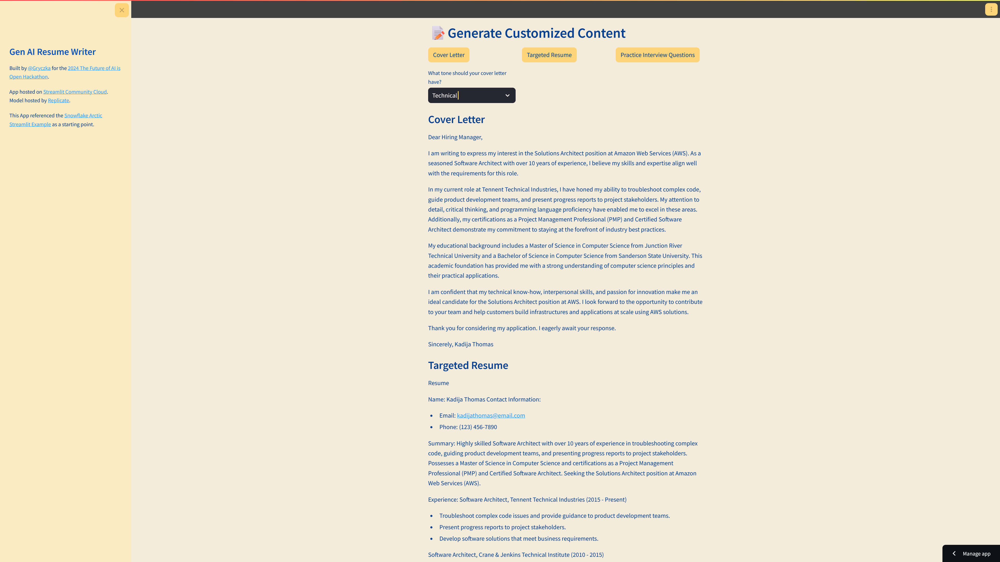

# Gen AI Resume Builder

Gen AI Resume Builder is a Hackathon Submission for the ['The Future of AI is Open' 2024 Hackathon](https://arctic-streamlit-hackathon.devpost.com/).

This is a simple streamlit app that takes in inputs and uses the Snowflake Arctic LLM to help a user target their resume for a given role/position.

If the user has a job description, the app will work to tailor the user's experience and skills to best match the job description.  If the user only has a job title, then the LLM will be used to generate relevant keywords the app should work towards with the user's past experience.

## 💡 Inspiration
In today's job market, standing out is more important than ever. I noticed that many applicants struggle to tailor their resumes and cover letters for specific job postings, often missing opportunities to highlight relevant skills and experiences. Inspired by the potential of generative AI, I envisioned a tool that not only automates this process but also prepares candidates with custom practice interview questions, enhancing their confidence and readiness for interviews.

## 🚀 What it does
The Gen AI Resume Builder is a tool designed to assist job seekers in creating highly customized job application materials. 

Users can input their applicant information either through direct text entry or by uploading a PDF or Word document of their resume. Additionally, they can specify the job they are applying for either by entering job details manually or by providing a link to the job posting. 

The system then generates a tailored resume, a personalized cover letter, and a set of practice interview questions that are specific to the job application, leveraging the power of Snowflake Arctic LLM for content generation.

## 🔧 How I built it
I built the Gen AI Resume Builder using Python and Streamlit, which provided a simple yet powerful framework for creating an interactive web application. The application is hosted on Streamlit Cloud, ensuring it is accessible anywhere and scalable. For the AI component, I utilized Snowflake Arctic LLM through Replicate's API service, which allowed me to integrate advanced language model capabilities efficiently. This setup made for quick setup for the purpose of a proof of concept.

## 🚩 Challenges I ran into
The biggest challenge I had for this project was that the context window for the Snowflake Arctic LLM is smaller than the typical size of the context that I wanted to provide (job posting details and existing applicant resume or background information).

In order to work around the token limit, I called the Arctic LLM separately to summarize the key information from the applicant resume/background, and to summarize the linked or copied job description. I then used these shorter summaries as the context for the LLM prompts to generate the tailored Cover Letter, Targeted Resume, and Practice Interview Questions.

This is a passable workaround, but there is convenience to models that support larger context windows and can take in more larger and more complete context. It would be nice to see some Arctic models with larger context windows in the future.

The output size also at times runs up against the currently configured limits, so it would make sense to split up sections of the resume as separate individual inferences in the future, or use a model with larger output windows.

Additionally, the intermediary summary inferences did add some additional latency. I have tried to minimize that impact by having it split out so that the summary inference is done after the content is provided, rather than having all of the inferences done when the content is requested, but it still isn't a highly responsive user experience just yet.

## 🏆 Accomplishments that I'm proud of
I am particularly proud of the system's ability to seamlessly integrate complex AI-generated content with user inputs. Achieving a high degree of customization in the resumes and cover letters and providing genuinely useful interview preparation material are significant accomplishments. The feedback from initial users has been overwhelmingly positive, with many noting the high quality and professional appearance of the application materials.

## 🎓 What I learned
This project was my first time using and deploying a Streamlit application. It was a lot of fun using this Python framework, and while custom styling was a little bit of a pain, it is a really convenient framework for a quick proof of concept.

## 🔮 What's next for Gen AI Resume Builder
Currently, Gen AI Resume Builder is really in a proof of concept stage. In order to make it more useful, it would be worthwhile to break out the resume generation into generating separate resume sections like professional summary/objective, work experience, education, skills, certifications, and projects, and allow users to save and iterate on the content for each of those sections separately.

I would also want to test using chain of thought prompting to have the model reason through its targeting logic to see if we could get better results, along with self-critiquing iterations.

It would also benefit from some thought around how best to reduce latency on inferences.

## 😎 Team
This project was built by Patrick Gryczka, a developer, solutions architect, and hacker (not the security kind).

- GitHub: [Gryczka](https://github.com/Gryczka)
- LinkedIn: [Patrick Gryczka](https://www.linkedin.com/in/gryczka/)
- Profile: [gryczka.net](https://www.gryczka.net/)

